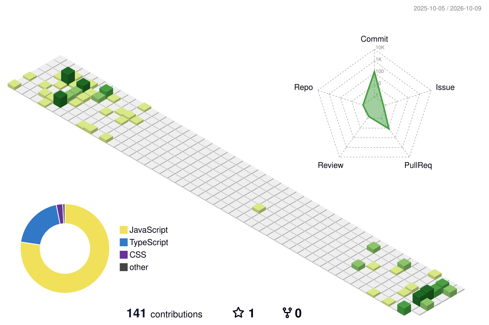

<!-- Replace every YOUR_USERNAME and "Your Name" before committing. -->


<div align="center">

<a href="https://github.com/YOUR_USERNAME">
  
</a>

<br/>


<br/><br/>

<a href="https://www.linkedin.com/in/YOUR_USERNAME"></a>
<a href="https://x.com/YOUR_USERNAME"></a>
<a href="mailto:you@example.com"></a>
<a href="https://yourwebsite.dev"></a>

</div>

<br/>

## 👋 About Me

I'm a **Full Stack developer with a backend-first mindset**. I design and build reliable APIs, scalable services, and clean user interfaces, and I care about performance, security, and maintainability.

- 🔭 Currently building **scalable microservices and cloud-native applications**
- ⚙️ Focused on **API design, databases, caching, and distributed systems**
- 🌱 Always learning: **system design, Kubernetes, and observability**
- 🤝 Open to **collaborations, open-source contributions, and interesting problems**

<br/>

## 🛠️ Tech Stack

<div align="center">

**Backend**


**Frontend**


**Databases & Messaging**


**DevOps & Tools**


</div>

<br/>

## 🧊 3D Contribution Graph

<div align="center">

<picture>
  <source media="(prefers-color-scheme: dark)" srcset="./profile-3d-contrib/profile-night-view.svg" />
  
</picture>

</div>

<br/>

## 📊 GitHub Stats

<div align="center">

<picture>
  <source media="(prefers-color-scheme: dark)" srcset="https://github-readme-stats.vercel.app/api?username=YOUR_USERNAME&show_icons=true&theme=tokyonight&hide_border=true&include_all_commits=true&count_private=true&rank_icon=github" />
  
</picture>
<picture>
  <source media="(prefers-color-scheme: dark)" srcset="https://github-readme-stats.vercel.app/api/top-langs/?username=YOUR_USERNAME&layout=compact&theme=tokyonight&hide_border=true&langs_count=8" />
  
</picture>

<br/>

<picture>
  <source media="(prefers-color-scheme: dark)" srcset="https://streak-stats.demolab.com?user=YOUR_USERNAME&theme=tokyonight&hide_border=true" />
  
</picture>

</div>

<br/>

## 📈 Contribution Activity

<div align="center">

<picture>
  <source media="(prefers-color-scheme: dark)" srcset="https://github-readme-activity-graph.vercel.app/graph?username=YOUR_USERNAME&theme=tokyo-night&hide_border=true&area=true&custom_title=Contribution%20Graph" />
  
</picture>

</div>

<br/>

## 🐍 Contribution Snake

<div align="center">

<picture>
  <source media="(prefers-color-scheme: dark)" srcset="https://raw.githubusercontent.com/YOUR_USERNAME/YOUR_USERNAME/output/github-snake-dark.svg" />
  <source media="(prefers-color-scheme: light)" srcset="https://raw.githubusercontent.com/YOUR_USERNAME/YOUR_USERNAME/output/github-snake.svg" />
  
</picture>

</div>

<br/>

## 💬 Let's Connect

<div align="center">

I'm always happy to talk about backend architecture, APIs, and building great products.
**Feel free to reach out or open an issue. Let's build something great together.**

<a href="mailto:you@example.com"></a>

⭐ *If you like this profile, consider giving the repo a star!* ⭐

</div>

<details>
<summary><b>⚙️ Setup: GitHub Actions workflow for the 3D graph and snake (click to expand)</b></summary>

<br/>

The 3D graph and the snake are generated by GitHub Actions. To enable them:

1. Save the YAML below as `.github/workflows/profile-animations.yml` in this repository.
2. Go to **Settings → Actions → General → Workflow permissions** and select **Read and write permissions**.
3. Open the **Actions** tab, choose **Profile Animations**, and click **Run workflow** once.
4. Replace every `YOUR_USERNAME` in this README with your GitHub username.

You can delete this section once everything is working.

```yaml
name: Profile Animations

on:
  schedule:
    - cron: "0 */12 * * *"
  workflow_dispatch:
  push:
    branches: [main]

permissions:
  contents: write

jobs:
  contrib-3d:
    name: Generate 3D contribution graph
    runs-on: ubuntu-latest
    timeout-minutes: 10
    steps:
      - uses: actions/checkout@v5

      - uses: yoshi389111/github-profile-3d-contrib@latest
        env:
          GITHUB_TOKEN: ${{ secrets.GITHUB_TOKEN }}
          USERNAME: ${{ github.repository_owner }}

      - name: Commit generated files
        run: |
          git config user.name "github-actions[bot]"
          git config user.email "41898282+github-actions[bot]@users.noreply.github.com"
          git add -A profile-3d-contrib
          git diff --cached --quiet || git commit -m "chore: update 3D contribution graph"
          git push

  snake:
    name: Generate contribution snake
    runs-on: ubuntu-latest
    timeout-minutes: 10
    steps:
      - uses: Platane/snk/svg-only@v3
        with:
          github_user_name: ${{ github.repository_owner }}
          outputs: |
            dist/github-snake.svg
            dist/github-snake-dark.svg?palette=github-dark

      - uses: crazy-max/ghaction-github-pages@v3.1.0
        with:
          target_branch: output
          build_dir: dist
        env:
          GITHUB_TOKEN: ${{ secrets.GITHUB_TOKEN }}
```

</details>


